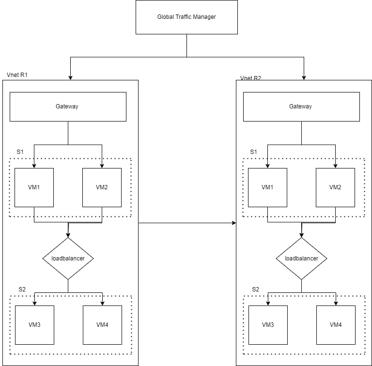

# 3 Tier Architecture Deployment
## Project Description

Implemented a 3-tier architecture for a web application using Terraform on Azure, with proper isolation of subnets, the project aims to demonstrate how modern cloud technologies can be harnessed to create a secure, scalable, and maintainable application infrastructure. This architecture serves as a foundation for future enhancements and can be used as a reference for similar deployment scenarios.

## Architecture Design



## How to Run 

### Step 1
```bash
git clone <Repo Link>
```
### Step 2
make a file named `terraform.tfvars` in repo and add the following credential's in it 
```js
az_subscription = "your Azure Subscription Id"
az_client_id = "your Azure Client Id"
az_client_secret = "your Azure Client Secret"
az_tenant = "your Azure Tenant"
```
### Step 3
- Initializes a new Terraform configuration
    ```
    terraform init
    ```
- Generates an execution plan
    ```
    terraform plan
    ```
- Applies the changes defined in your Terraform configuration to your infrastructure
    ```
    terraform apply
    ```
### Step 4
- destroys all resources defined in your Terraform configuration. 
    ```
    terraform destroy
    ```
